# Rapport TP01 - Docker

## Database

Création de l'image Docker pour la base de données PostgreSQL

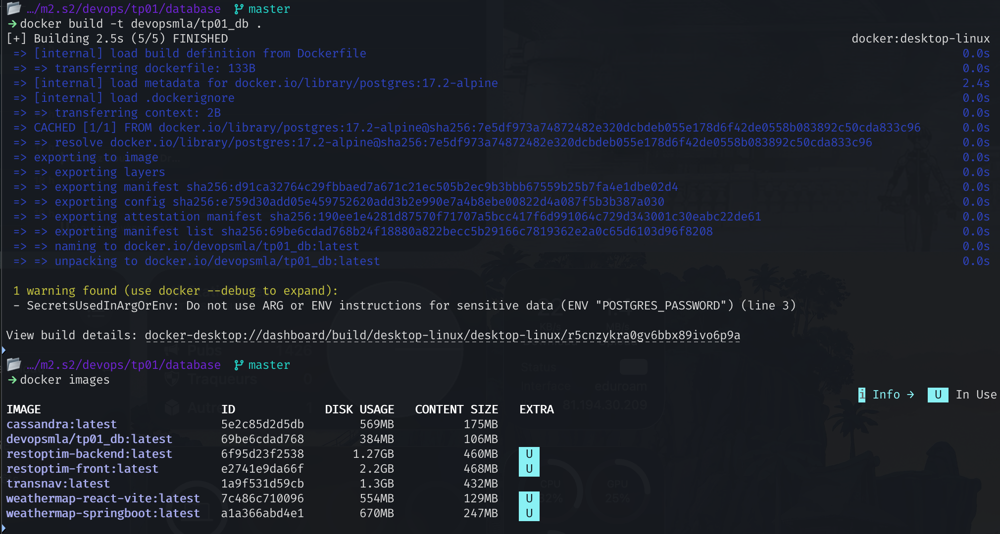

Démarrage du conteneur de la base de données

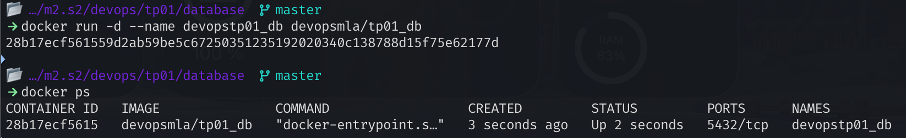

Redémarrage de la base de données avec adminer

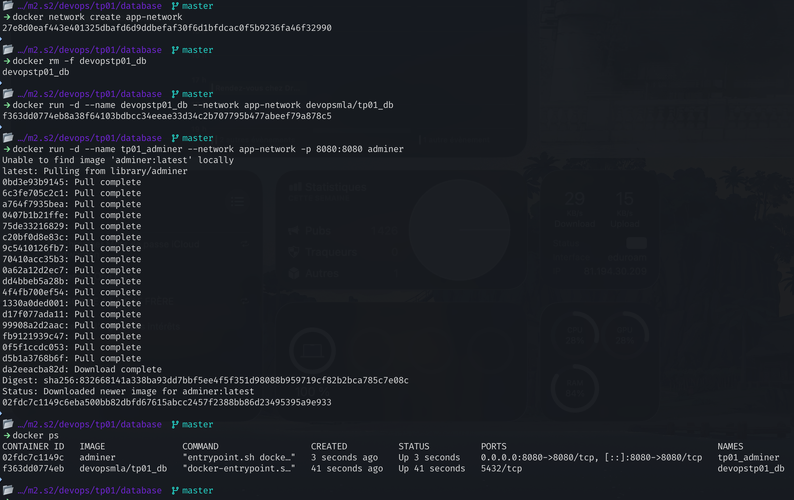

### Question 1-1

Il y a plusieurs raisons :

1. **Sécurité** : Les variables d'environnement peuvent contenir des informations sensibles telles que des mots de passe ou des clés d'API. En les fournissant au moment de l'exécution, on évite de les exposer dans le Dockerfile, qui peut être partagé ou versionné.
2. **Portabilité** : Les variables d'environnement permettent de rendre l'image Docker plus portable, car elles ne sont pas liées à une configuration spécifique. Cela facilite le déploiement de l'application dans différents environnements sans nécessiter de modifications du code (Dockerfile).
3. **Flexibilité** : En utilisant des variables d'environnement, on peut facilement modifier, ajouter ou supprimer les paramètres de configuration sans avoir à reconstruire l'image Docker. Cela permet de réutiliser la même image pour différents environnements (développement, test, production) en fournissant des valeurs différentes pour les variables d'environnement.

---

Suppression des variables d'environnement du Dockerfile

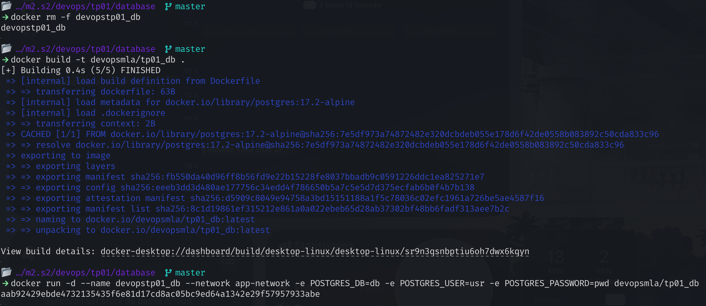

Ajout des scripts d'initalisation

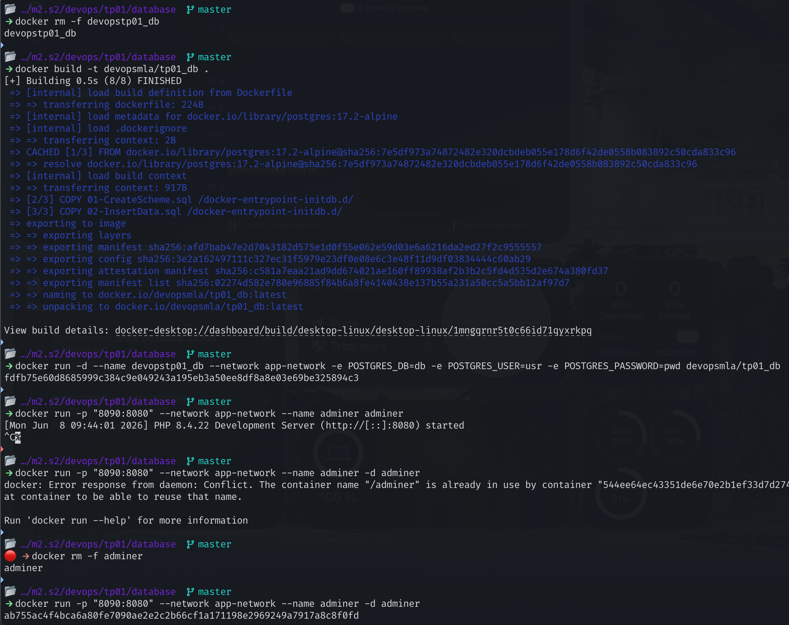

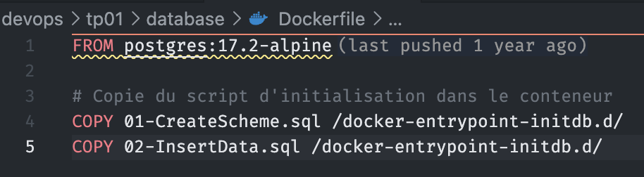

On arrive à s'y connecter via <http://localhost:8090/?pgsql=devopstp01_db&username=usr&db=db&ns=public>

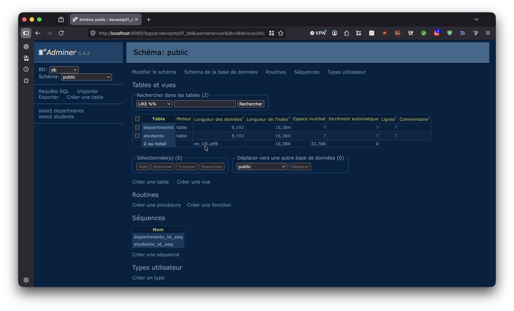

---

Avant l'utilisation de volumes, on modifie "IRC" par "test"

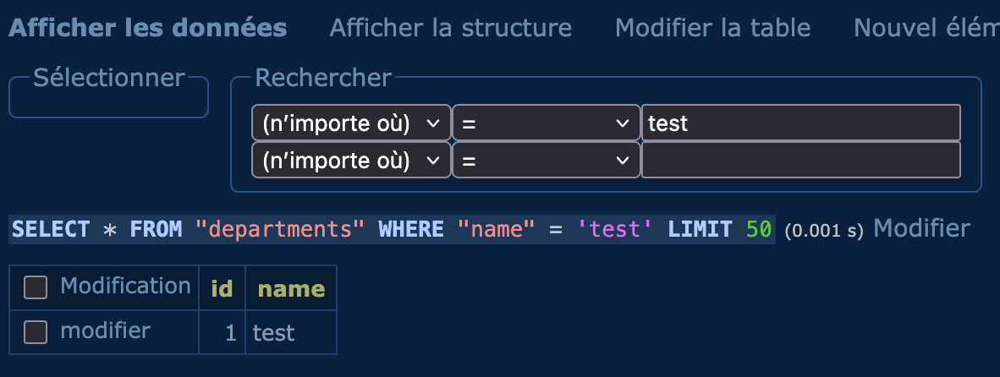

puis on redémarre le conteneur. "test" a disparu

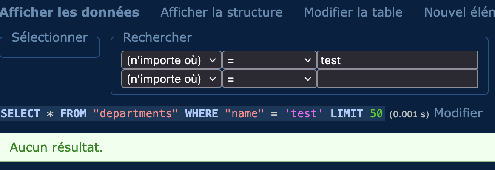

Après l'utilisation de volumes, on modifie "IRC" par "test"

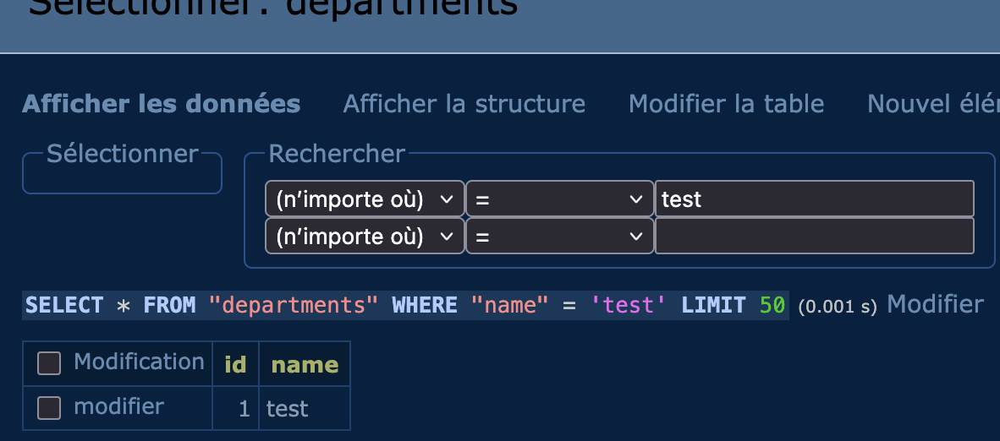

On supprime le conteneur puis on le redémarre. "test" est toujours là

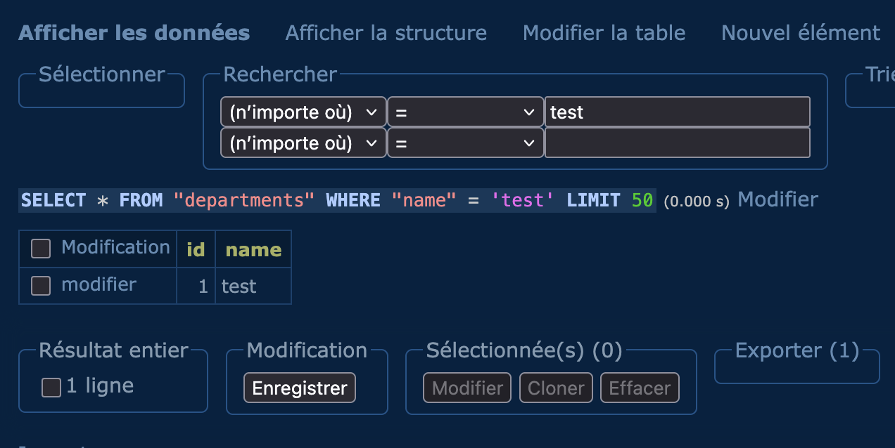

### Question 1-2

On a besoin d'un volume pour plusieurs raisons :

1. **Persistance des données** : Les conteneurs Docker sont éphémères, ce qui signifie que les données stockées à l'intérieur du conteneur seront perdues lorsque celui-ci est supprimé ou redémarré. En attachant un volume, les données sont stockées en dehors du conteneur, ce qui permet de les conserver même si le conteneur est supprimé ou redémarré.
2. **Partage de données** : Un volume permet de partager des données entre le conteneur et l'hôte ou entre plusieurs conteneurs. Cela facilite la gestion des données et permet à plusieurs conteneurs d'accéder aux mêmes données sans avoir à les dupliquer.

### Question 1-3

Voici les commandes essentielles pour gérer un conteneur de base de données avec Docker, ainsi qu'un exemple de Dockerfile pour une base de données PostgreSQL.

Le Dockerfile, avec uniquement les variables d'environnement non critiques :

```Dockerfile
FROM postgres:17.2-alpine

ENV POSTGRES_DB=db \
   POSTGRES_USER=usr

# Copie du script d'initialisation dans le conteneur
COPY 01-CreateScheme.sql /docker-entrypoint-initdb.d/
COPY 02-InsertData.sql /docker-entrypoint-initdb.d/
```

Les commandes pour gérer le conteneur de base de données :

**Construire l'image Docker** :

```bash
docker build -t devopsmla/tp01_db .
```

**Démarrer le conteneur** :

```bash
docker run \
	# Le nom du conteneur pour faciliter la gestion et la connexion dans adminer
   --name devopstp01_db \
   # Le network pour permettre la communication avec d'autres conteneurs (comme adminer dans notre cas)
   --network app-network \
   # Les variables d'environnement critiques pour configurer la base de données
   -e POSTGRES_PASSWORD=pwd \
   # Les volumes pour assurer la persistance des données
   -v datadir:/var/lib/postgresql/data \
   -d \
   devopsmla/tp01_db
```

Démarrer le conteneur adminer pour accéder à la base de données :

```bash
docker run \
   --name tp01_adminer \
   # Le network pour permettre la communication avec d'autres conteneurs (comme adminer dans notre cas)
   --network app-network \
   # Le mappage des ports pour accéder à adminer depuis l'hôte
   -p "8090:8080" \
   -d \
   adminer
```

## Backend API

Création de l'image Docker et démarrage du conteneur du backend Spring Boot

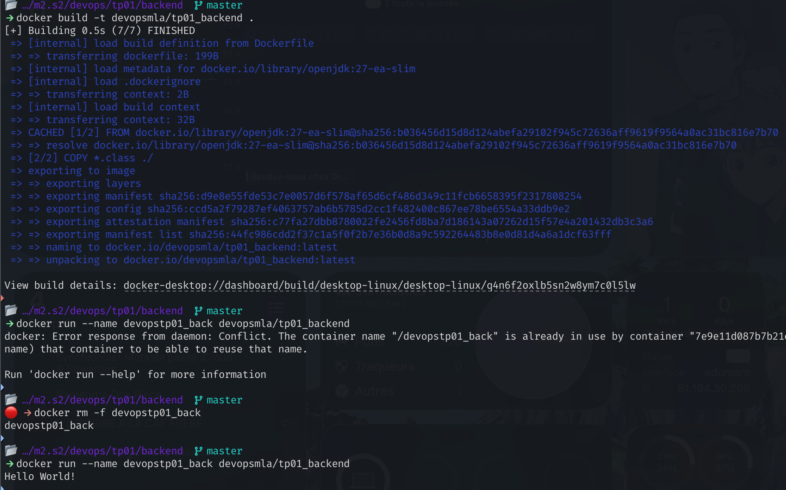

```Dockerfile
FROM openjdk:27-ea-slim

# Add the compiled java (aka bytecode, aka .class)
COPY *.class ./

# Run the Java with: “java Main” command.
CMD ["java", "Main"]

```

### Question 1-4

Un multistage build est nécessaire pour optimiser la taille de l'image Docker finale en séparant les étapes de construction et d'exécution. Cela permet de ne copier que les fichiers nécessaires à l'exécution de l'application dans l'image finale, sans les outils ou dépendances, réduisant ainsi la taille de l'image.

Build stage :

1. **FROM eclipse-temurin:21-jdk-alpine AS myapp-build** : Utilise une image de base contenant le JDK pour la phase de construction et nomme cette étape "myapp-build".
2. **ENV MYAPP_HOME=/opt/myapp** : Définit une variable d'environnement pour le chemin de l'application.
3. **WORKDIR $MYAPP_HOME** : Définit le répertoire de travail pour les commandes suivantes.
4. **RUN apk add --no-cache maven** : Installe Maven pour construire l'application.
5. **COPY pom.xml .** : Copie le fichier de configuration Maven dans le conteneur.
6. **COPY src ./src** : Copie le code source de l'application dans le conteneur.
7. **RUN mvn package -DskipTests** : Exécute la commande Maven pour construire l'application, en sautant les tests.

Run stage :

1. **FROM eclipse-temurin:21-jre-alpine** : Utilise une image de base plus légère contenant uniquement le JRE pour la phase d'exécution.
2. **ENV MYAPP_HOME=/opt/myapp** : Définit la même variable d'environnement pour le chemin de l'application.
3. **WORKDIR $MYAPP_HOME** : Définit le répertoire de travail pour les commandes suivantes.
4. **COPY --from=myapp-build $MYAPP_HOME/target/\*.jar $MYAPP_HOME/myapp.jar** : Copie le fichier JAR généré dans la phase de construction vers l'image finale.
5. **ENTRYPOINT ["java", "-jar", "myapp.jar"]** : Définit la commande d'entrée pour exécuter l'application Java lorsque le conteneur démarre.

---

Tout fonctionne, on arrive bien à récupérer les données de la base de données depuis le backend

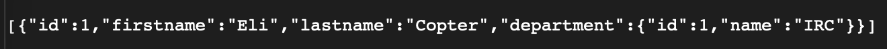

## HTTP Server

Construction de l'image et démarrage du conteneur du reverse proxy HTTP

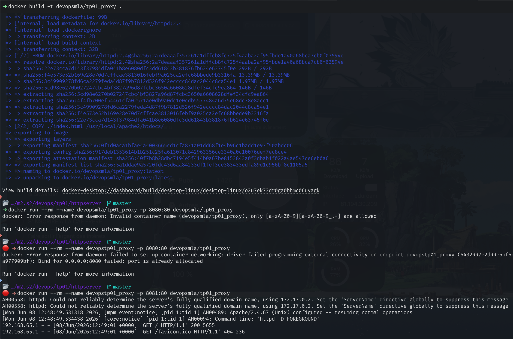

Visible depuis <http://localhost:8081>

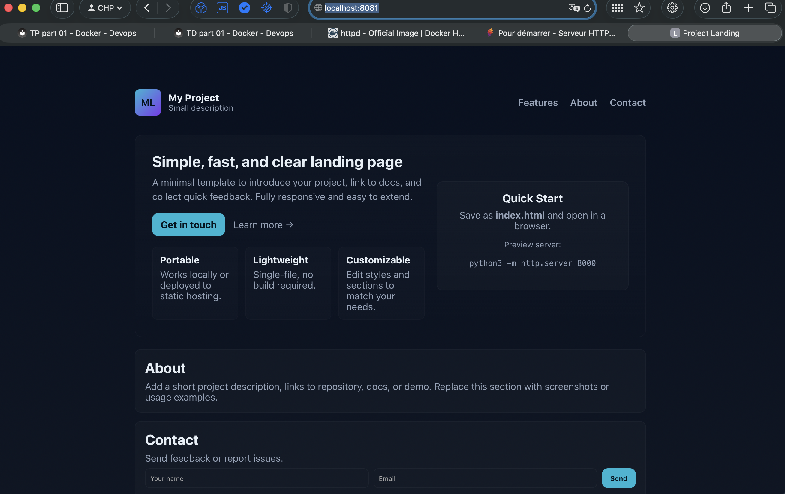

---

On récupère la configuration

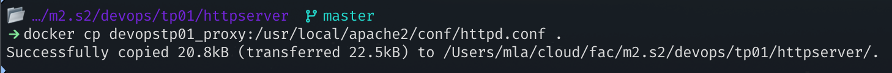

On relance le conteneur proxy, en copiant la configuration dans le conteneur

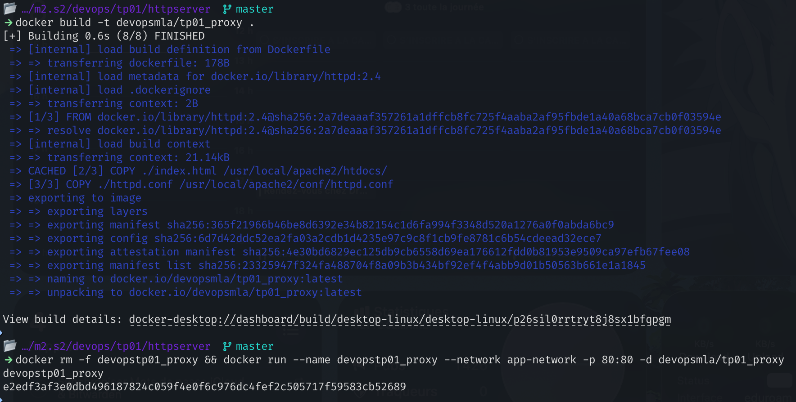
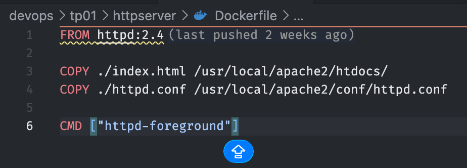

## Question 1-5

Un reverse proxy peut agir comme une couche de sécurité supplémentaire en filtrant les requêtes entrantes, en bloquant les attaques potentielles et en protégeant les serveurs backend contre les accès non autorisés.

Après utilisation du docker-compose

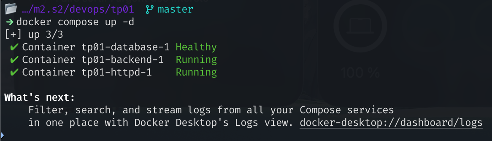

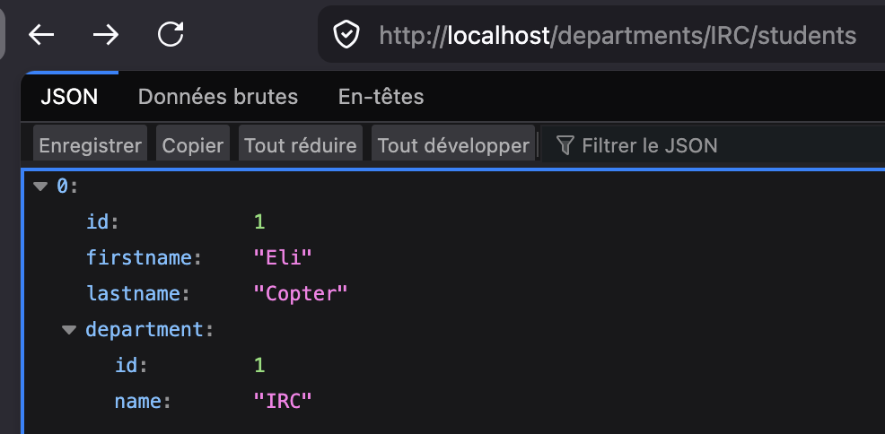

## Question 1-6

Docker compose permet d'avoir toute la configuration dans un seul fichier, et de gérer facilement les dépendances entre les services. Il facilite également le déploiement, avec une seule commande uniforme, qui ne change pas en fonction des services utilisés (`docker-compose up -d`). De plus, il offre une meilleure lisibilité et maintenabilité de la configuration, en regroupant tous les services et leurs configurations dans un seul endroit.

## Question 1-7

La commande la plus importante est `docker-compose up -d` qui permet de démarrer tous les services définis dans le fichier `docker-compose.yml` en arrière-plan (`-d`).

## Question 1-8

```yaml
services:
  # Database service using PostgreSQL
  database:
    # On utilise le dockerfile configuré pour construire l'image de la base de données
    build:
      context: ./database
      dockerfile: Dockerfile
    # Redémarrer le conteneur à moins qu'il ne soit arrêté manuellement
    restart: unless-stopped
    # Les variables d'environnement pour configurer la base de données
    environment:
      POSTGRES_DB: ${POSTGRES_DB:-db}
      POSTGRES_USER: ${POSTGRES_USER:-usr}
      POSTGRES_PASSWORD: ${POSTGRES_PASSWORD:-pwd}
    # Volume pour persister les données de la base de données
    volumes:
      - postgres_data:/var/lib/postgresql/data
    # Réseau privé pour la communication entre les conteneurs de l'application
    networks:
      - comp-app-network

  # Backend service pour l'API Spring Boot
  backend:
    # On utilise le dockerfile configuré pour construire l'image de la partie backend de l'application
    build:
      context: ./backend/simpleapi
      dockerfile: Dockerfile
    # Redémarrer le conteneur à moins qu'il ne soit arrêté manuellement
    restart: unless-stopped
    # Les variables d'environnement pour configurer la base de données
    environment:
      SPRING_DATASOURCE_URL: jdbc:postgresql://database:5432/${POSTGRES_DB:-db}
      SPRING_DATASOURCE_USERNAME: ${POSTGRES_USER:-usr}
      SPRING_DATASOURCE_PASSWORD: ${POSTGRES_PASSWORD:-pwd}
    # Créer une dépendance explicite pour s'assurer que le backend démarre après la base de données
    depends_on:
      database:
        condition: service_healthy
    # Réseau privé pour la communication entre les conteneurs de l'application
    networks:
      - comp-app-network

  httpd:
    # On utilise le dockerfile configuré pour construire l'image du serveur HTTP
    build:
      context: ./httpserver
      dockerfile: Dockerfile
    # Redémarrer le conteneur à moins qu'il ne soit arrêté manuellement
    restart: unless-stopped
    # Exposer le port 80 pour accéder au serveur HTTP depuis l'extérieur du conteneur
    ports:
      - "80:80"
    # Créer une dépendance explicite pour s'assurer que le serveur HTTP démarre après le backend
    depends_on:
      backend:
        condition: service_started
    # Réseau privé pour la communication entre les conteneurs de l'application
    networks:
      - comp-app-network

networks:
  # Réseau privé pour la communication entre les conteneurs de l'application
  comp-app-network:
    driver: bridge # Valeur par défaut

volumes:
  # Volume créé par docker (sans préciser de chemin local) pour stocker les données de PostgreSQL
  postgres_data:
```

## Question 1-9

On push nos images sur Docker Hub

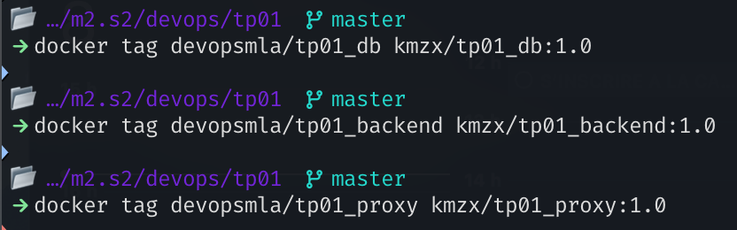

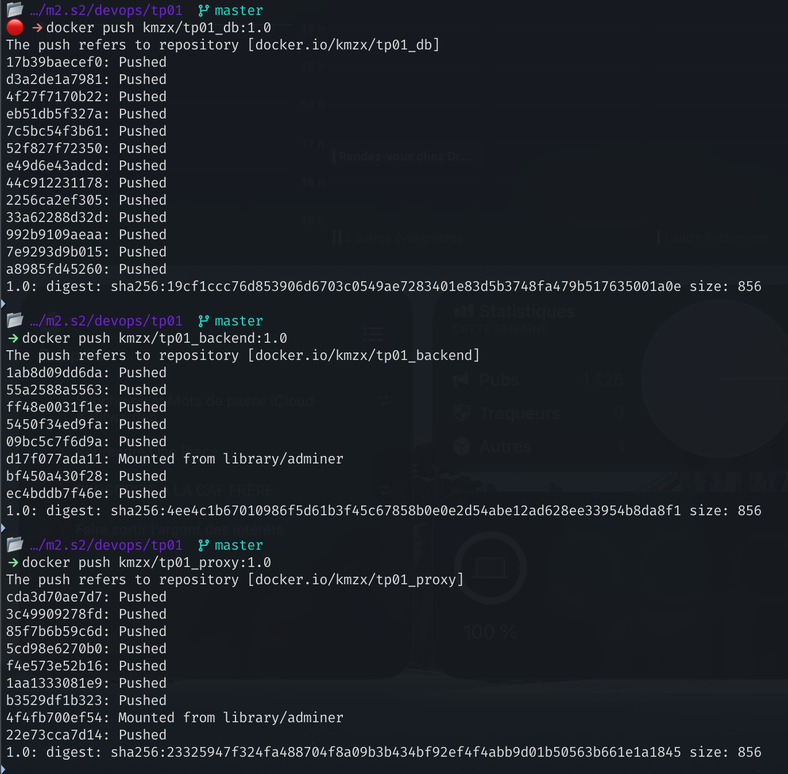

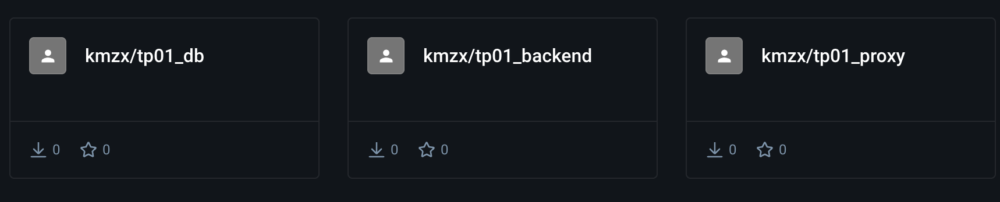

## Question 1-10

Cela permet de ne pas avoir à construire les images localement à chaque fois. En utilisant des images pré-construites depuis Docker Hub, on peut directement récupérer les images nécessaires en ligne.
