# TD 02 - GitHub Actions

## Question 2-1

> What are testcontainers?

Testcontainers est une bibliothèque Java supportant JUnit, qui fournit des conteneurs Docker légers pour les tests d'intégration, des bases de données et tout autre service pouvant s'exécuter dans un conteneur Docker.

---

Les tests ne fonctionnent pas localement. Selon le prof, c'est le code qui n'est plus à jour.

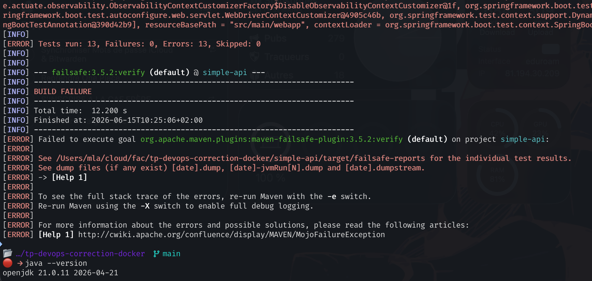

---

Configuration du workflow

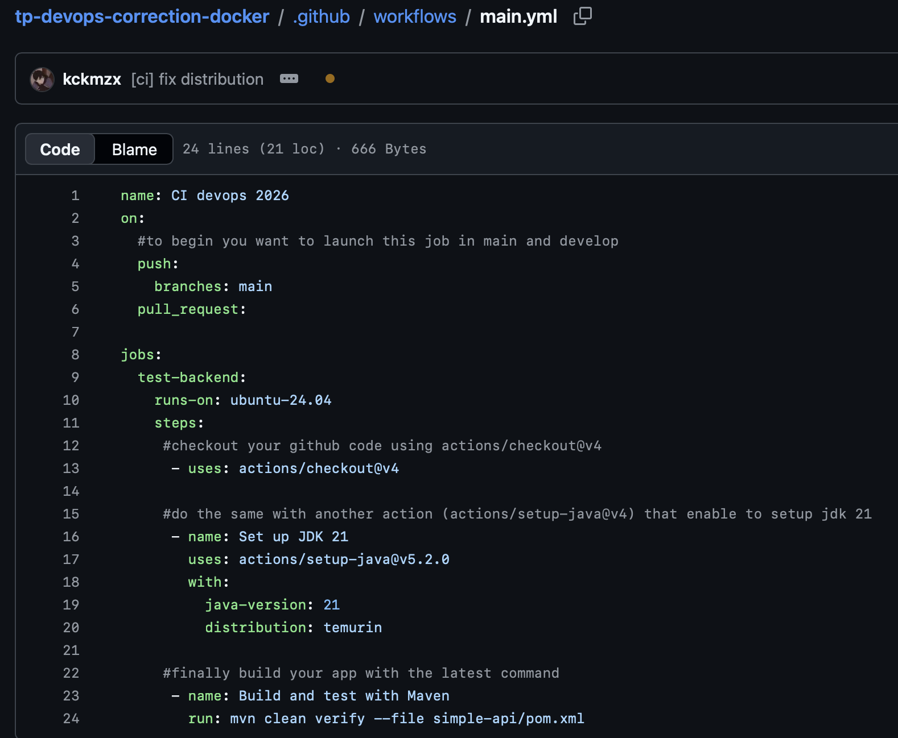

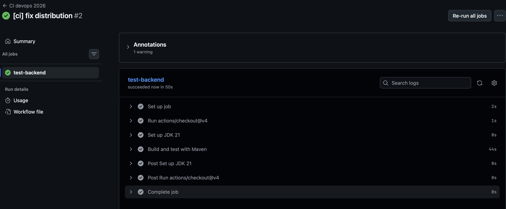

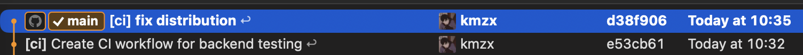

---

Configuration du token Docker

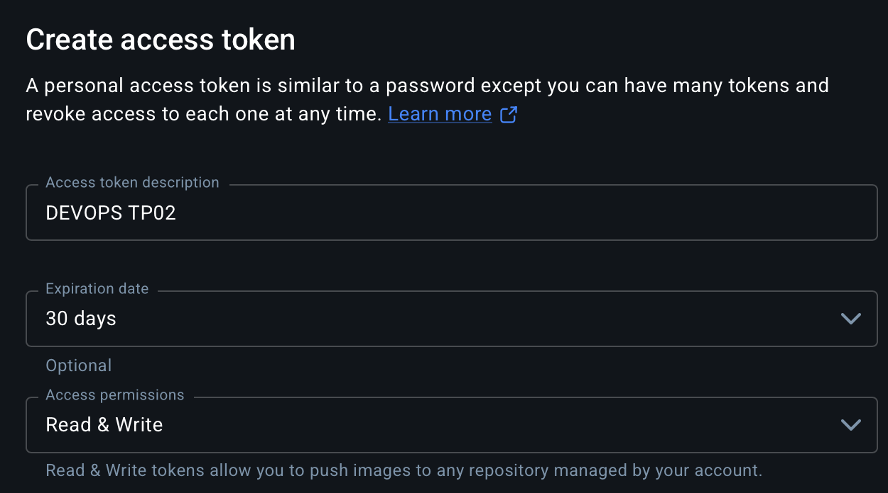

Configuration des secrets

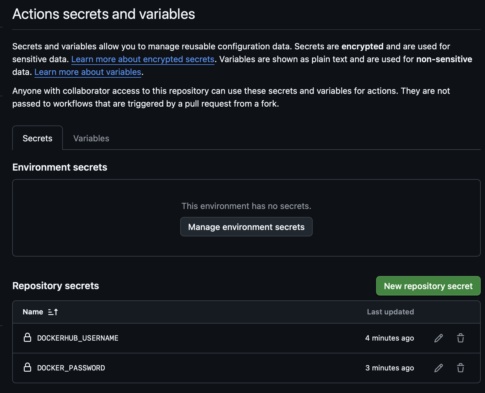

## Question 2-2

On utilise des variables sécurisées pour stocker des informations sensibles telles que des mots de passe, des clés API ou d'autres secrets qui ne doivent pas être exposés dans le code source ou les fichiers de configuration. Cela permet de protéger ces informations contre les accès non autorisés.

## Question 2-3

On a mis `needs: build-and-test-backend` sur ce job pour indiquer que ce job dépend de l'exécution réussie du job `build-and-test-backend`. Cela signifique que si les tests ne passent pas, on ne publie pas l'image Docker.

---

Build les images

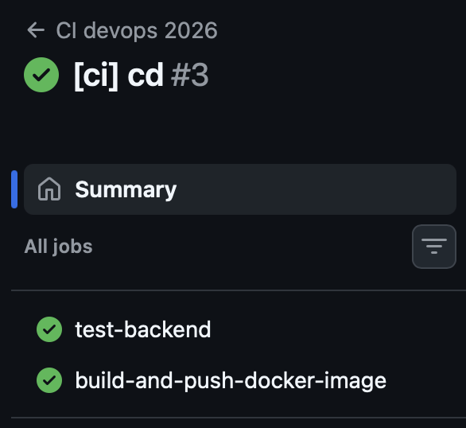

Et ça marche:

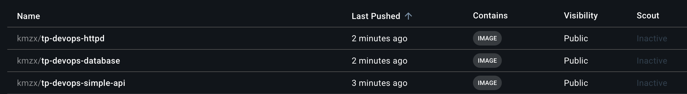

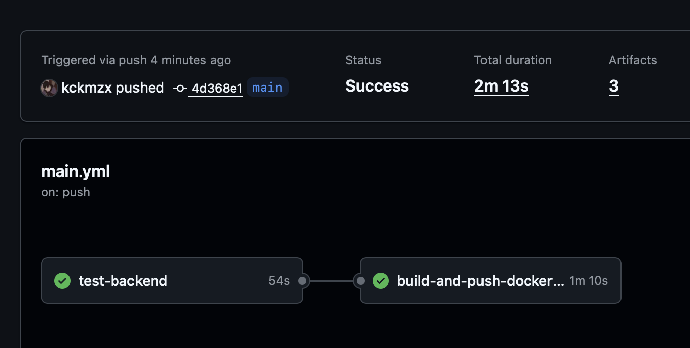

---

On crée l'organisation et le projet sur SonarCloud. Puis on crée des secrets

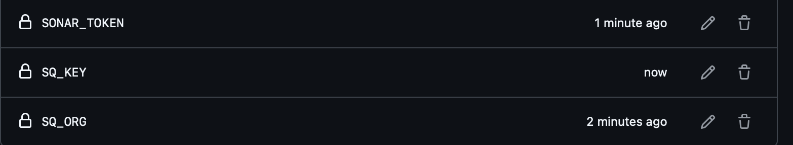

On suit les instructions de SonarQube pour la configuration, avec un job supplémentaire pour l'analyse du code. Voici donc le workflow final:

```yaml
name: CI devops 2026
on:
  #to begin you want to launch this job in main and develop
  push:
    branches:
      - main
      - develop
  pull_request:

jobs:
  test-backend:
    runs-on: ubuntu-24.04
    steps:
      #checkout your github code using actions/checkout@v4
      - uses: actions/checkout@v4

      #do the same with another action (actions/setup-java@v4) that enable to setup jdk 21
      - name: Set up JDK 21
        uses: actions/setup-java@v5.2.0
        with:
          java-version: 21
          distribution: temurin

      #finally build your app with the latest command
      - name: Build and test with Maven
        run: mvn clean verify --file simple-api/pom.xml

  analysis:
    runs-on: ubuntu-latest
    needs: test-backend
    steps:
      - uses: actions/checkout@34e114876b0b11c390a56381ad16ebd13914f8d5 # v4.3.1
        with:
          fetch-depth: 0 # Shallow clones should be disabled for a better relevancy of analysis

      - name: Set up JDK 21
        uses: actions/setup-java@c1e323688fd81a25caa38c78aa6df2d33d3e20d9 # v4.8.0
        with:
          java-version: 21
          distribution: "zulu" # Alternative distribution options are available.

      - name: Cache SonarQube packages
        uses: actions/cache@0057852bfaa89a56745cba8c7296529d2fc39830 # v4.3.0
        with:
          path: ~/.sonar/cache
          key: ${{ runner.os }}-sonar
          restore-keys: ${{ runner.os }}-sonar

      - name: Cache Maven packages
        uses: actions/cache@0057852bfaa89a56745cba8c7296529d2fc39830 # v4.3.0
        with:
          path: ~/.m2
          key: ${{ runner.os }}-m2-${{ hashFiles('**/pom.xml') }}
          restore-keys: ${{ runner.os }}-m2

      - name: Build and analyze
        env:
          SONAR_TOKEN: ${{ secrets.SONAR_TOKEN }}
        run: mvn -B verify org.sonarsource.scanner.maven:sonar-maven-plugin:sonar -Dsonar.projectKey=${{ secrets.SQ_KEY }} -f simple-api/pom.xml

  # define job to build and publish docker image
  build-and-push-docker-image:
    needs: analysis
    # run only when code is compiling and tests are passing
    runs-on: ubuntu-24.04

    # steps to perform in job
    steps:
      - name: Checkout code
        uses: actions/checkout@v4

      - name: Login to DockerHub
        run: echo "${{ secrets.DOCKER_PASSWORD }}" | docker login --username ${{ secrets.DOCKERHUB_USERNAME }} --password-stdin

      - name: Build image and push backend
        uses: docker/build-push-action@v7.2.0
        with:
          # relative path to the place where source code with Dockerfile is located
          context: simple-api
          # Note: tags has to be all lower-case
          tags: ${{secrets.DOCKERHUB_USERNAME}}/tp-devops-simple-api:latest
          push: ${{ github.ref == 'refs/heads/main' }}

      - name: Build image and push database
        uses: docker/build-push-action@v7.2.0
        with:
          # relative path to the place where source code with Dockerfile is located
          context: database
          # Note: tags has to be all lower-case
          tags: ${{secrets.DOCKERHUB_USERNAME}}/tp-devops-database:latest
          push: ${{ github.ref == 'refs/heads/main' }}

      - name: Build image and push httpd
        uses: docker/build-push-action@v7.2.0
        with:
          # relative path to the place where source code with Dockerfile is located
          context: http-server
          # Note: tags has to be all lower-case
          tags: ${{secrets.DOCKERHUB_USERNAME}}/tp-devops-httpd:latest
          push: ${{ github.ref == 'refs/heads/main' }}
```

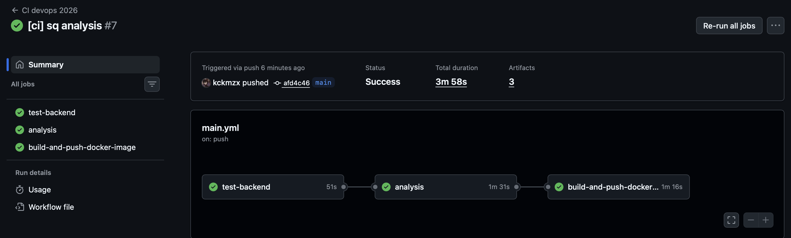

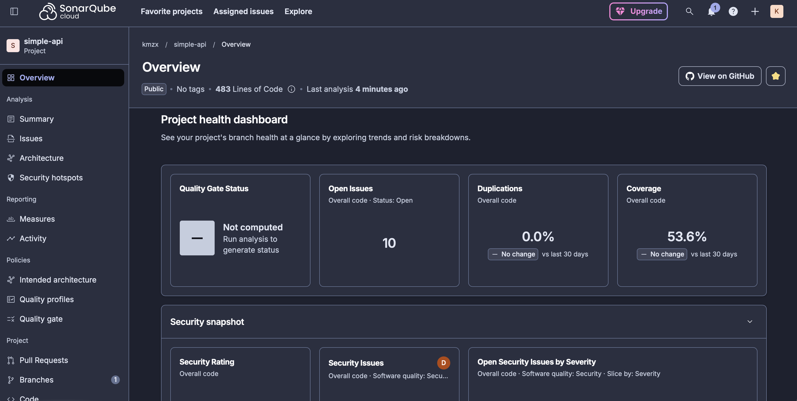
