# TD 03 - Ansible

Fichier setup.yaml

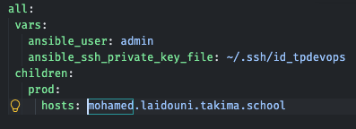

## Facts

Ping de connectivité

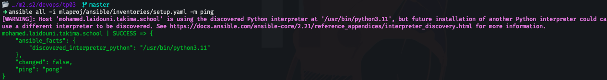

Collecte de métadonnées (Facts) et Gestion de paquets avec droits élevés

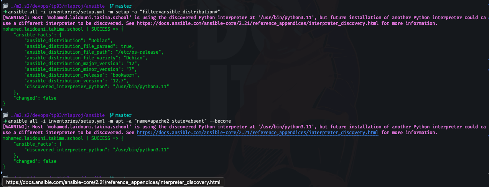

## Playbooks

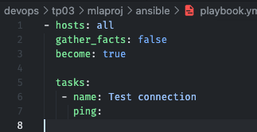

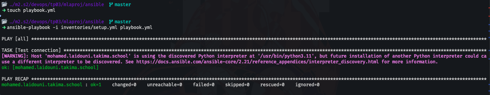

### Advanced playbook

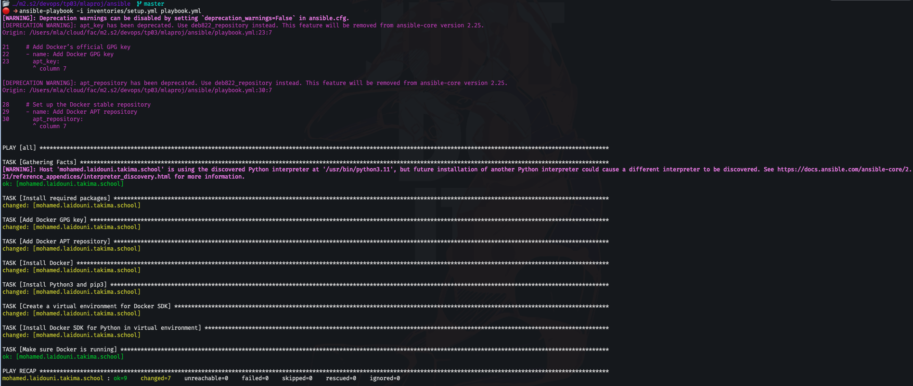

Et docker est bien disponible

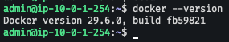

## Using roles

Nouveau playbook

```yaml
- hosts: all
  gather_facts: true
  become: true
  roles:
    - docker

  tasks:
    # Install prerequisites for Docker
    - name: Install required packages
      apt:
        name:
          - apt-transport-https
          - ca-certificates
          - curl
          - gnupg
          - lsb-release
          - python3-venv
        state: latest
        update_cache: yes

    # Add Docker’s official GPG key
    - name: Add Docker GPG key
      apt_key:
        url: https://download.docker.com/linux/debian/gpg
        state: present

    # Set up the Docker stable repository
    - name: Add Docker APT repository
      apt_repository:
        repo: "deb [arch=amd64] https://download.docker.com/linux/debian {{ ansible_facts['distribution_release'] }} stable"
        state: present
        update_cache: yes

    # Install Docker
    - name: Install Docker
      apt:
        name: docker-ce
        state: present

    # Install Python3 and pip3
    - name: Install Python3 and pip3
      apt:
        name:
          - python3
          - python3-pip
        state: present

    # Create a virtual environment for Python packages
    - name: Create a virtual environment for Docker SDK
      command: python3 -m venv /opt/docker_venv
      args:
        creates: /opt/docker_venv # Only runs if this directory doesn’t exist

    # Install Docker SDK for Python in the virtual environment
    - name: Install Docker SDK for Python in virtual environment
      command: /opt/docker_venv/bin/pip install docker

    # Ensure Docker is running
    - name: Make sure Docker is running
      service:
        name: docker
        state: started
      tags: docker
```

main.yaml

```yaml
#SPDX-License-Identifier: MIT-0
---
# tasks file for roles/docker

# On installe les prérequis pour Docker
- name: Install required packages
  apt:
    name:
      - apt-transport-https
      - ca-certificates
      - curl
      - gnupg
      - lsb-release
      - python3-venv
    state: latest
    update_cache: yes

# On ajoute la clé GPG officielle de Docker
- name: Add Docker GPG key
  apt_key:
    url: https://download.docker.com/linux/debian/gpg
    state: present

# On configure le dépôt stable de Docker
- name: Add Docker APT repository
  apt_repository:
    repo: "deb [arch=amd64] https://download.docker.com/linux/debian {{ ansible_facts['distribution_release'] }} stable"
    state: present
    update_cache: yes

# On installe Docker
- name: Install Docker
  apt:
    name: docker-ce
    state: present

# On installe Python3 et pip3
- name: Install Python3 and pip3
  apt:
    name:
      - python3
      - python3-pip
    state: present

# On crée un environnement virtuel pour les packages Python
- name: Create a virtual environment for Docker SDK
  command: python3 -m venv /opt/docker_venv
  args:
    creates: /opt/docker_venv # Only runs if this directory doesn’t exist

# On installe le SDK Docker pour Python dans l'environnement virtuel
- name: Install Docker SDK for Python in virtual environment
  command: /opt/docker_venv/bin/pip install docker

# On s'assure que Docker est en cours d'exécution
- name: Make sure Docker is running
  service:
    name: docker
    state: started
  tags: docker
```

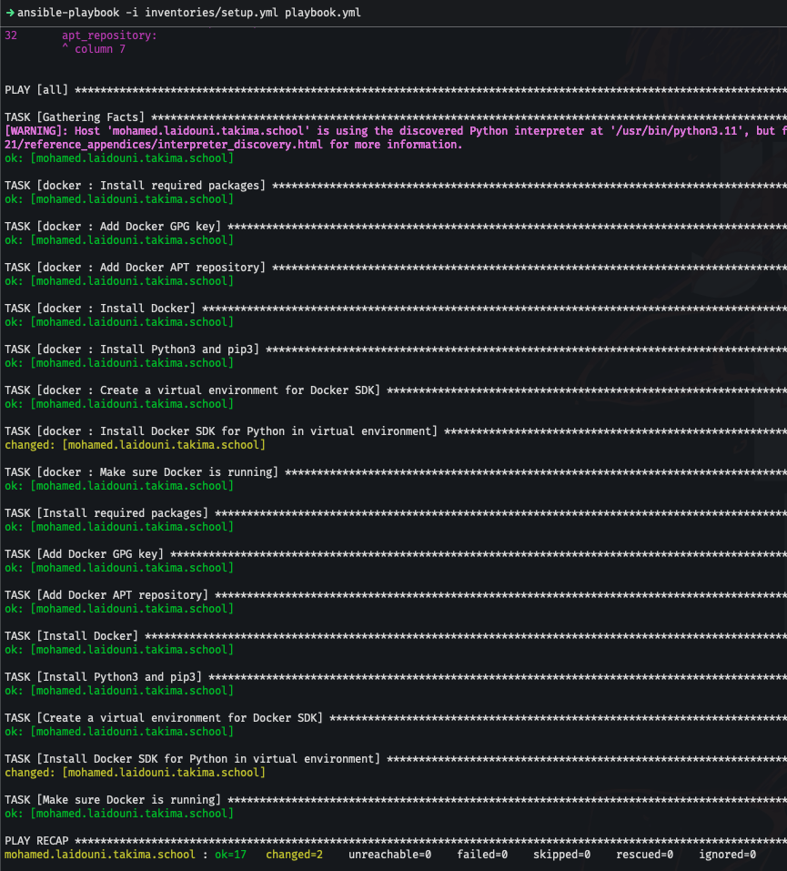

## Deploy

Création des rôles

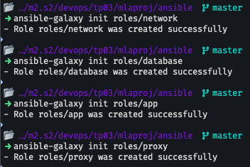

Lancement du playbook

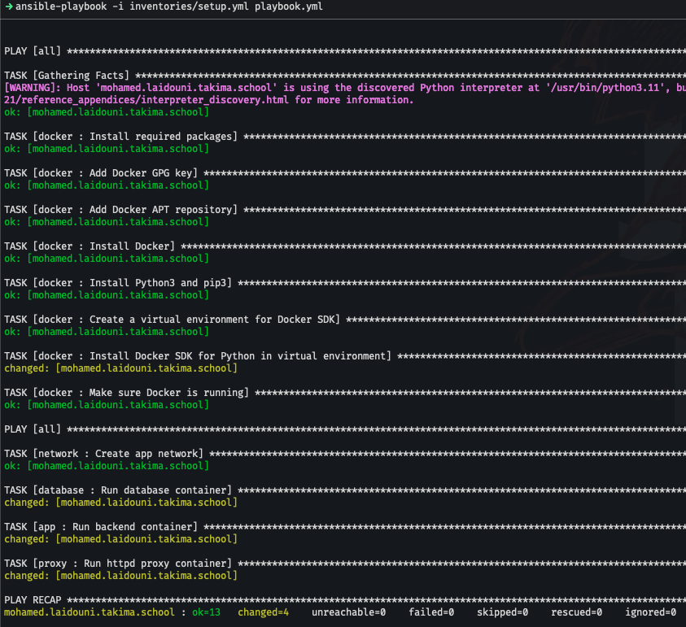

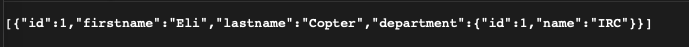

setup.yml

```yaml
all:
  vars: # On définit des variables globales appliquées à l'ensemble des hôtes
    ansible_user: admin # Indique à Ansible de se connecter sur la machine distante avec l'utilisateur nommé admin
    ansible_ssh_private_key_file: ~/.ssh/id_tpdevops # Spécifie le chemin local de la clé SSH privée
    dockerhub_username: kmzx
  children: # Permet de créer des groupes logiques de serveurs.
    prod: # On a créé un groupe nommé prod
      hosts: mohamed.laidouni.takima.school # On a défini un hôte nommé mohamed.laidouni.takima.school
```

network/main.yml

```yaml
---
- name: Create app network
  community.docker.docker_network:
    name: app-network
```

app/main.yml

```yml
---
- name: Launch application
  community.docker.docker_container:
    name: backend
    image: "{{ dockerhub_username }}/tp-devops-simple-api:latest"
    networks:
      - name: app-network
    env:
      SPRING_DATASOURCE_URL: "jdbc:postgresql://database:5432/db"
      SPRING_DATASOURCE_USERNAME: usr
      SPRING_DATASOURCE_PASSWORD: pwd
    state: started
    recreate: true
    pull: true
```

database/main.yml

```yaml
---
- name: Launch database
  community.docker.docker_container:
    name: database
    image: "{{ dockerhub_username }}/tp-devops-database:latest"
    networks:
      - name: app-network
    env:
      POSTGRES_DB: db
      POSTGRES_USER: usr
      POSTGRES_PASSWORD: pwd
    volumes:
      - db-data:/var/lib/postgresql/data
    state: started
    recreate: true
    pull: true
```

proxy/main.yml

```yaml
---
- name: Launch httpd proxy
  community.docker.docker_container:
    name: httpd
    image: "{{ dockerhub_username }}/tp-devops-httpd:latest"
    networks:
      - name: app-network
    ports:
      - "80:80"
    state: started
    recreate: true
    pull: true
```

J'ai rencontré plusieurs difficulté avec mes images. J'ai du utiliser les images de Servan car je n'arrivais pas à faire fonctionner les miennes. Tout le reste de mon code fonctionne, sauf les images.

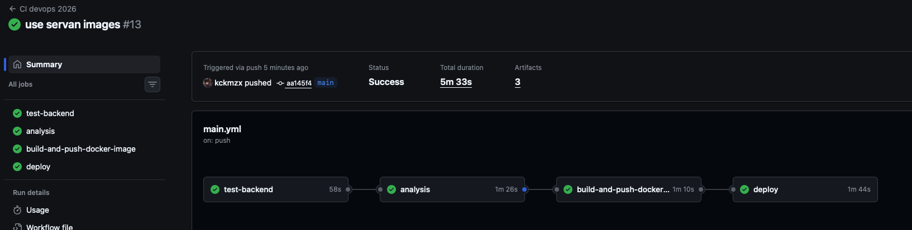

Le déploiement fonctionne bien !

## Question 3-4

Non, il n'est pas vraiment sûr de déployer automatiquement chaque nouvelle image sur le hub, car cela peut introduire des risques de sécurité. Par exemple, une nouvelle image pourrait contenir des vulnérabilités ou des erreurs qui pourraient compromettre la sécurité de l'application ou du système.

## Front

Voici le résultat final du front :

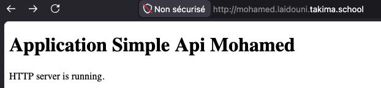
